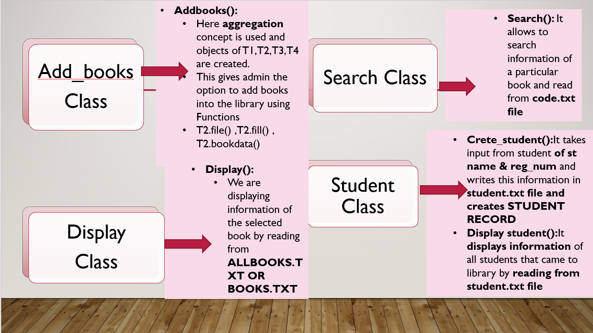

# Library_Management_system
A library management system implemented in OOP(C++)
This is a simple library management system written in C++ using OOP concepts. The program allows students and faculty to issue books from the library, with different limits and durations based on their roles

# Features
Students and faculty can issue books from the library.

The number of books that can be issued is limited for both students and faculty.

The duration for which a book can be issued is different for students and faculty.

Each book has a unique ID, even if there are multiple copies of the same book with the same name and author.

The program uses OOP principles for better organization and maintainability of the code.

# Usage
To use the library management system, simply compile the library.cpp file and supporting header files and run the resulting executable. 
The program will prompt the user to enter their role (student or faculty), and will then guide them through the process of issuing a book.
The other files of book names etc will be generated depending on the books and subjects added.

# Working
The following images describe the working of our Library Management System, the inheritance between classes and member functions' description

# Contributing
Contributions to the library management system are welcome! If you find a bug or have a 
suggestion for a new feature, please open an issue on the GitHub repository. 
If you would like to contribute code to the project, please fork the repository and submit a pull request.
